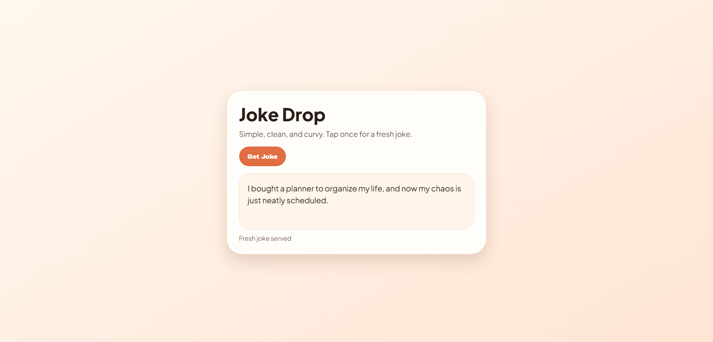

# AI Joke App

A modern, full-stack web application that serves fresh, AI-generated jokes using OpenAI's GPT models. The app features a clean user interface and a robust backend with built-in fallback mechanisms to ensure users always get a laugh, even when the API is unreachable or the quota is exceeded.

## Preview



## Features

- **AI-Powered Humor**: Leverages OpenAI's `gpt-4o-mini` for high-quality, natural-sounding jokes.
- **Structured Data**: Uses OpenAI's JSON Schema response format for guaranteed payload consistency.
- **Robust Fallbacks**: Automatically serves a curated list of fallback jokes if the API is unavailable or the key is missing.
- **Safe Rendering**: Implements HTML escaping on the frontend to protect against XSS when rendering dynamic content.
- **Responsive UI**: Interactive "Tell me a joke" button with active loading states and status feedback.

## Tech Stack

**Frontend:**
- HTML5 & CSS3
- Vanilla JavaScript (ES6+)

**Backend:**
- Node.js & Express
- `node-fetch` for API communication
- `dotenv` for environment management
- `cors` for cross-origin resource sharing

## Project Structure

```text
ai-joke-app/
├── public/
│   ├── index.html   # Frontend structure
│   ├── index.js     # Frontend logic & API calls
│   └── 1.png        # App screenshot
├── server.js        # Express server & OpenAI integration
├── .env             # Environment variables (ignored by git)
├── package.json     # Project dependencies
└── README.md        # Project documentation
```

## Getting Started

### Prerequisites

*   Node.js 18 or higher
*   An OpenAI API Key (Optional, fallback jokes work without it)

### Installation

1.  **Navigate to the project directory:**
    ```powershell
    cd ai-joke-app
    ```

2.  **Install dependencies:**
    ```powershell
    npm install
    ```

3.  **Configure Environment Variables:**
    Create a `.env` file in the root directory and add your configuration:
    ```env
    OPENAI_API_KEY=your_actual_key_here
    PORT=3000
    ```

### Running the App

1.  **Start the server:**
    ```powershell
    npm start
    ```
2.  **View the app:**
    Open your browser and navigate to `http://localhost:3000`.

## API

### `POST /joke`
Fetches a joke from the AI model or returns a fallback.

**Request Body:** ` {} `

**Response Schema:**
```json
{
  "joke": "string"
}
```
